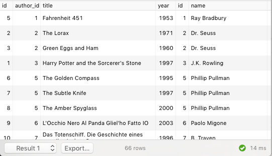
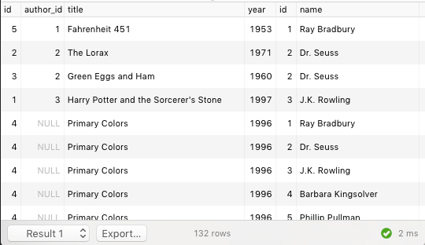
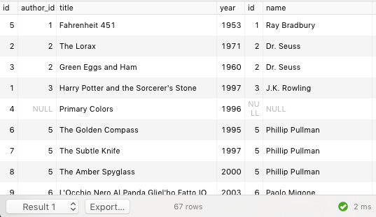
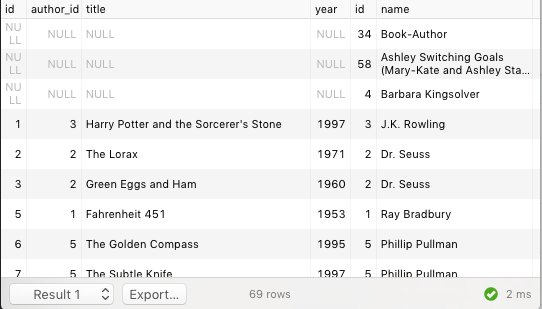
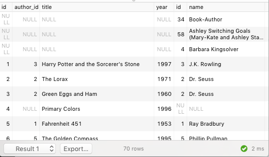

## SQL Joins

In the beginning, there were no joins. Well, there were joins, but they weren’t a part of the language; they existed in the way that people thought about writing their queries. But there was no JOIN keyword. Instead, people used what are now called 'implicit joins'. Even though we have explicit joins now, it’s instructive to look at what people did instead.

When you do `SELECT * FROM author a WHERE a.name = 'J.K. Rowling'`, you can imagine that you're scanning the whole `author` table and selecting out only those rows where `a.name` is 'J.K. Rowling'. Your database promises to produce an answer that is equivalent to the one you would get if you imagine things working that way, even if it might take some shortcuts in computing it. For example, you might have an index on `author.name`, so the database knows exactly where to look to find the right rows.

When you run

```sql
SELECT * FROM author a, book b
WHERE b.year_published > 2007 AND a.zipcode = '63110'
```

imagine that you are taking every choice of `author` with every choice of `book`, then checking the *where* clause bits. In procedural code, this would looks like a nested for loop:

```python
for a in authors:
    for b in books:
        if b.year_published > 2007 and a.zipcode == '63110':
            result_set.append((a, b))
```

This is called a `CROSS JOIN`. If it's not filtered, it produces `size(left_table) * size(right_table)` rows, one for every possible pair. All of our other joins are just going to be special WHERE clauses applied on top of a cross join.

More often, we're doing an `INNER JOIN`. This is the one people mean when they just say `JOIN`. It pairs up rows from the left and right tables, usually based on a foreign key. Something like this:

```sql
SELECT * FROM book b, author a
WHERE b.author_id = a.id
```



Again, you can think of this a looping over all possible pairs of `(b, a)`, but in this case we only take the ones that make sense together. A cross join of `book` and `author` contains (for example) a row that puts *Fahrenheit 451* together with 'Dr. Seuss'. But it's not clear what that's supposed to mean. In an inner join, we only have rows that match a book with the author of that very book. Using more modern syntax, we could write that as

```sql
SELECT *
FROM book b JOIN author a ON (b.author_id = a.id)
```

Something to note about an inner join is that rows don't have to appear. For example, *Primary Colors* was published anonymously, so its `author_id` field is `NULL`. There isn't an author with a `NULL` id, so it won't be able to find an author to pair with. It just won't show up anywhere in the table.

What if we wanted *Primary Colors* to show up in our result? We'd like to be able to say something like this

```sql
-- warning: this probably doesn't do what you want
SELECT * FROM book b, author a
WHERE b.author_id IS NULL or b.author_id = a.id
```

If you think back to our mental execution model, you might see the error here. We consider *every possible pair* (b, a) for inclusion, so *Primary Colors* gets paired with (for example) J.K. Rowling, Dr. Seuss, Ray Bradbury, ... In each case, it's `author_id` is still `NULL`, so that pairing will be included:



We could probably kludge together a query that did what we wanted without using the `JOIN` keyword, but we've reached about the limits of what implicit joins can do for us. Instead, let's write out what we want using explicit joins:

```sql
SELECT *
FROM book b LEFT OUTER JOIN author a ON (b.author_id = a.id)
```



Just as there's a `LEFT OUTER JOIN`, we also have a `RIGHT OUTER JOIN`.

In our context, we might use a `RIGHT OUTER JOIN` when we wanted to list even authors who don't have any books in our `book` table.

```sql
SELECT *
FROM book b RIGHT OUTER JOIN author a ON (b.author_id = a.id)
```



As you may have guessed, left and right outer joins are symmetric. Anytime you're doing `x LEFT OUTER JOIN y` it is equivalent to doing `y RIGHT OUTER JOIN x`. Most people tend to stick to left outer joins. (I just checked the TopOPPS codebase, and we have 17 left joins and only one right join).

Finally, there is the `FULL OUTER JOIN`. Every row from the left and right tables will be represented in the result, whether it has a mate from the other side or not.

```sql
SELECT *
FROM book b FULL OUTER JOIN author a ON (b.author_id = a.id)
```




## Exercises

1. Find the names of people are currently borrowing a book.
2. Find the titles of books that were checked out on August 3, 2015 (You can get just write out `'2015-08-03'`).
3. Find the 25 books that were lent most recently (For this query, you'll need the `ORDER BY` and `LIMIT` words. For example: `SELECT name FROM friends ORDER BY age LIMIT 5`. You may want to do some googling to learn how they work. There's also the [postgresql documentation](http://www.postgresql.org/docs/9.4/static/queries-order.html)).
4. Find the names of borrowers who have ever borrowed a book by Phillip Pullman.
5. Find borrowers who have a book written by Phillip Pullman currently on loan.

#### The rest of the exercises are more complicated. They involve `GROUP BY` and aggregation, which is a bit complicated. We can go over that on another day, or you can do some googling. The [postgres tutorial site](http://www.postgresqltutorial.com/postgresql-group-by/) seems to have a good page on this idea.

6. Find the top 10 most-checked-out books. What about currently-checked out?
7. Find the borrowers with the most (in number) overdue books. What about by cost?
8. Find the copy with the most use (most loans)
9. List people who have read every Phillip Pullman book in the database.
10. Find the borrowers who have read books that were also read by the people who have read every Phillip Pullman book in the database.
11. Rank the borrowers by how many books they have in common with the borrower 'Williams Igo'. Note that a borrower may have checked out a book more than once. Only count distinct books.
12. Score each pair of borrowers on their compatibility.
    1. Prevent borrowers from being compared with themselves.
    2. Make sure there's only row for each pair of people. ie: Lyndon Cammarata and Katheleen Baird should appear together in only one row, not one for "Lyndon vs Katheleen" and another for "Katheleen vs Lyndon".
13. Tally the popularity of books published in each year between 1990 and 2000. Include a row for each year, even if the number of loans of books from that year is zero. (Hint: you may find a function called `generate_series` to be useful here)
14. Find the biggest Dr. Seuss fan.
