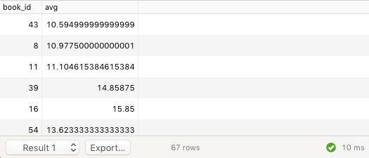
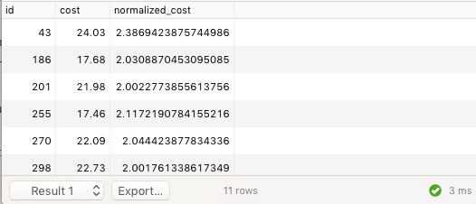
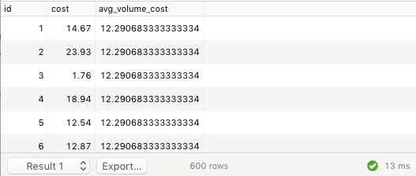
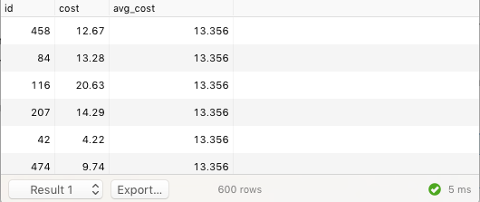
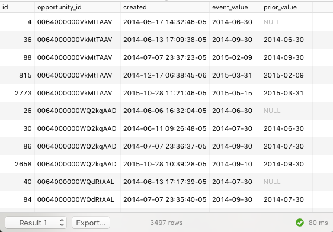

Window functions allow you to perform a calculation among some group of rows, and then each row gets to know about the result. This is hard to understand without an example so here we go. With a regular old group by, we can find the average cost of the copies of some books:

```sql
SELECT book_id, AVG(cost)
FROM book_copy
GROUP BY 1
```



But what if we wanted to know the copies of a book for which we overpaid. That is, not the most expensive books, but the copies of a book that were more than twice as expensive as the average copy of that same book. Here's an (in my opinion) inelegant way of doing this, with a join.

```sql
SELECT id, cost, cost::float / avg_cost AS normalized_cost
FROM book_copy JOIN (
    SELECT book_id, AVG(cost) AS avg_cost
    FROM book_copy
    GROUP BY 1
) avg_costs
ON (book_copy.book_id = avg_costs.book_id)
WHERE cost::float / avg_cost >= 2
```



Not that that's such a terrible query, but we're learning about window functions here. Let's do it with window functions. We'll build up to it in three steps. First, let's get a Listing of every `book_copy` compared to the average price of volumes in our library.

```sql
SELECT id, cost, AVG(cost) OVER () AS avg_volume_cost
FROM book_copy
```



It's the `OVER ()` bit that tells us we're using a window function. A window function has

  - An aggregate. Here it's `AVG(cost)`.
  - A partition (optional). We didn't use one.
  - An order (optional). We didn't use one.

We can get closer to the answer we want by adding the partition clause:

```sql
SELECT id, cost, AVG(cost) OVER (PARTITION BY book_id) AS avg_cost
FROM book_copy
```



The partition clause chops up the result set so that all the rows have the same value in each listed attribute (here just `book_id`). Our window function reads something like this in English, "Give me the average cost among all `book_copy`s that have the same `book_id` as me".

And finally, the question we wanted to answer:

```sql
SELECT id, cost, normalized_cost
FROM (
    SELECT id, cost,
      cost::float / AVG(cost) OVER (PARTITION BY book_id)  AS normalized_cost
    FROM book_copy
) with_normalized_cost
WHERE normalized_cost >= 2
```

Hmm, that turns out not to be such a nice example. I forgot that window functions can't be used in the `WHERE`-clause of a query, so we have to do the window function calculation inside a subquery, then filter it afterwards. Oh well.

At TopOPPS, we commonly use window functions to query the event table. For instance when we're calculating the `prior_value`, we use something like this:

```sql
SELECT id, opportunity_id, created, event_value,
    lag(event_value) OVER (PARTITION BY opportunity_id ORDER BY created) AS prior_value
FROM api_event
WHERE organization_id = '00Do0000000JJfoEAG' AND event_type = 'expected_close_date'
```



Here, our window function reads "Give me the `event_value` from the row right before me (that's `lag()`), in the group that has the same `opportunity_id` as I do, ordered by `created`." Notice the `NULL` that sometimes appears in the results. That happens when there *isn't* a "row right before me". That is, this is the first with that `opportunity_id`, sorted by `created`.

## Exercises

1. Sometimes people use important papers as bookmarks and forget them there. Make a query listing who checked out each copy of a book immediately before the latest borrower.
2. Find the books where one borrower consists of at least 30% of the loans on that book. If you need help getting started, this gets you some of the way there: [exercise2_hint.sql](#file-exercise2_hint-sql)
3. Find the 10th borrower of each book (not book_copy). Hint: A list of some available window functions can be found at https://www.postgresql.org/docs/9.4/static/functions-window.html
